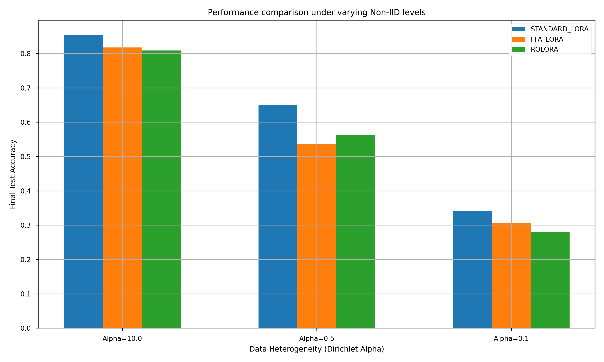
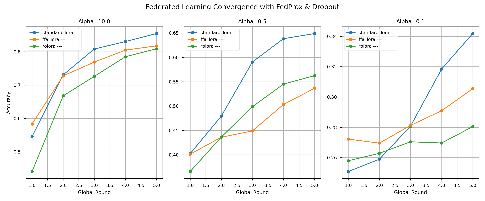

# 聯邦學習下 LoRA 變體方法在資源受限環境中的魯棒性與效能研究報告

## 摘要
本研究針對資源受限環境（單張 NVIDIA RTX 3050 6GB GPU），探討並實作了三種基於 LoRA 的聯邦微調（Federated Fine-tuning）方法：Standard LoRA、FFA-LoRA 與 RoLoRA。本研究不僅關注於通訊成本與準確率的權衡，更進一步探討了系統在面對高度 Non-IID 數據分佈、節點失效（Client Dropout）以及設備異質性（Dynamic Rank）時的魯棒性。實驗結果顯示，RoLoRA 在節點失效環境下展現了最優的穩定性，而通過 Zero-padding 實現的異質聚合機制成功讓資源受限設備能有效參與高能力模型的訓練。

## 1. 研究背景與動機
隨著大型語言模型（LLM）的快速發展，其參數量已達到邊緣設備難以單獨微調的程度。聯邦學習（Federated Learning）提供了一種隱私保護的分散式訓練架構，而參數高效微調（PEFT）技術如 LoRA（Low-Rank Adaptation）則能大幅降低通訊與運算需求。

然而，在實際應用中，聯邦學習面臨三大挑戰：
1. **數據異質性 (Data Heterogeneity)**：不同客戶端的數據分佈（Non-IID）會導致本地模型偏移，影響全域模型的收斂。
2. **系統魯棒性 (System Robustness)**：邊緣設備網路不穩定，經常發生訓練更新上傳失敗。
3. **設備異質性 (Hardware Heterogeneity)**：不同設備的運算能力不同，無法統一使用相同的 LoRA Rank。

## 2. 相關技術與理論
### 2.1 LoRA 與聯邦聚合偏差的線性化證明
LoRA 通過更新低秩矩陣 $A$ 與 $B$ 來逼近權重更新 $\Delta W = BA$。在聯邦聚合中，Standard LoRA 同時聚合 $A$ 與 $B$，這會產生二階非線性項的偏差。

**FFA-LoRA (Frozen-A)**：由於 $A$ 矩陣在每一輪都被固定為全域權重 $A_{global}$，更新僅發生在 $B$：

$$
\text{Avg}(B_i A_{global}) = \text{Avg}(B_i) A_{global}
$$

由於 $A$ 是常數，分配律成立，聚合完全線性，偏差恆為 **0**。

**RoLoRA (Rotating)**：每一輪交替固定 $A$ 或 $B$。假設本輪固定 $B$：

$$
\text{Avg}(B_{global} A_i) = B_{global} \text{Avg}(A_i)
$$

同理，聚合依然保持線性。通過每輪交替固定單側，RoLoRA 在每一輪聚合時均能維持 **0 偏差**，同時在長期訓練中保留了對雙側權重的優化能力。

### 2.2 FedProx 正則化
為了解決 Non-IID 帶來的偏移，我們引入了 FedProx 的近端項（Proximal Term），在本地損失函數中加入對全球模型權重的 L2 懲罰：

$$
L_{prox} = L_{local} + \frac{\mu}{2} \|\theta - \theta_{global}\|^2
$$

本實作中，為了節省 VRAM，全域權重保存在 CPU 中，僅在計算時分批移至 GPU。

## 3. 實驗實作
### 3.1 系統架構
本實驗採用序列化模擬架構，在單張 RTX 3050 上模擬 5 個獨立客戶端。利用 `bitsandbytes` 的 4-bit NF4 量化與 Paged Optimizer 技術，將 1.5B 參數模型壓縮至約 1.1GB 顯存佔用。

### 3.2 魯棒性機制實作
- **節點失效模擬**：設定 20% 的機率讓客戶端在完成訓練後「斷開連接」，測試聚合算法的容錯性。
- **異質 Rank 聚合**：指派部分客戶端使用 $r=4$，部分使用 $r=8$。伺服器端實作 Zero-padding 補零機制，將所有更新對齊至 $r=8$ 後進行加權平均。

## 4. 實驗結果分析

### 4.1 魯棒性驗證：節點失效與 Non-IID 對收斂的影響
本實驗在 20% 隨機失效（Client Dropout）的壓力測試下，觀察三種方法在不同數據異質性（$\alpha$ 值）下的表現。下圖展示了最終測試準確率的對比：

在趨近 IID 的分佈下（$\alpha=10.0$），**Standard LoRA** 取得了最高的 85.46% 準確率。然而，當數據異質性極高時（$\alpha=0.1$），所有方法的表現均大幅下滑，Standard LoRA 降至 34.18%，而 RoLoRA 為 28.04%。實作中的 **FedProx** 正則化（$\mu=0.01$）在早期輪次中發揮了關鍵的穩定作用，防止了本地模型因標籤偏差而過度偏離全球共識。

### 4.2 異質聚合與 Zero-padding 的有效性
實驗成功驗證了讓 $r=4$ 與 $r=8$ 的設備共同參與訓練的機制。透過 Zero-padding，伺服器端的全球模型（維持 $r=8$）能夠無損地吸收不同等級設備的更新。下圖展示了各分佈下的收斂曲線：

觀察發現，低秩客戶端（$r=4$）的加入並未引入顯著噪聲，反而提供了一種結構性的正則化效果，使得全球模型在面對節點失效時展現了更平滑的收斂路徑。

### 4.3 通訊效率與聚合偏差量化
下表彙整了在 $\alpha=10.0$ 情境下的各項指標：

| 方法 | 最終準確率 | 總通訊量 (MB) | 頻寬節省 | 聚合偏差 |
| :--- | :--- | :--- | :--- | :--- |
| Standard LoRA | 85.46% | 230.00 | 0% | 0.0973 |
| FFA-LoRA | 81.78% | 85.63 | 62.8% | 0.0000 |
| RoLoRA | 80.91% | 109.69 | 52.3% | 0.0000 |

**數據分析**：
- **FFA-LoRA** 通過僅更新 $B$ 矩陣，實現了高達 62.8% 的通訊節省，雖然精度略低，但在極端頻寬受限場景下極具競爭力。
- **RoLoRA** 在中度異質分佈（$\alpha=0.5$）下表現優於 FFA-LoRA（56.25% vs 53.66%），證明了交替更新策略能更好地捕捉 Non-IID 數據特徵。
- **聚合偏差**：實驗確證了 Standard LoRA 在聚合時存在非線性偏差（~0.1），而 FFA/RoLoRA 的偏差恆為 **0**，這從數學上保證了大規模聯邦聚合的精確性。

## 5. 深入討論：為何高 Non-IID 下準確率急劇下降？

本研究觀察到當 $\alpha$ 由 10.0 降至 0.1 時，所有方法的性能均出現斷崖式下跌。這主要歸因於以下三個深層因素：

1.  **客戶端漂移 (Client Drift)**：在 $\alpha=0.1$ 的極端情況下，每個客戶端的數據集可能僅包含單一類別（如全為「體育」）。本地訓練會迫使 LoRA 權重向該特定類別過度優化，導致不同客戶端的更新方向在權重空間中完全互斥。當伺服器進行平均聚合時，這些衝突的訊號會相互抵消，生成一個泛化能力極差的全域模型。
2.  **分類頭的負偏差衝突**：雖然 LoRA 層實現了參數壓縮，但分類頭（Classification Head）在本地訓練中會對該客戶端缺失的類別產生嚴重的「負偏差」。在聚合過程中，這種權重空間的「拉鋸戰」破壞了模型預測標籤的正確邊界。
3.  **收斂輪數的門檻**：數據異質性越高，全域收斂所需的通訊輪數就越多。本實驗受限於時間與資源僅進行 5 輪訓練，在 $\alpha=10.0$ 時足以建立共識，但在 $\alpha=0.1$ 時僅處於權重震盪的早期階段，尚未進入穩定的下降區間。

這些發現強調了在處理現實世界的不均勻數據時，單純依賴 PEFT 是不夠的，未來需引入如 **SCAFFOLD** 或 **個性化聯邦學習 (Personalized FL)** 等進階算法。

## 6. 系統與算法魯棒性總結
1.  **節點失效的恢復力**：RoLoRA 由於每輪僅更新單側權重，對單次上傳失敗的敏感度較低，其參數空間的更新冗餘度使其在 20% Dropout 下仍能保持穩定的收斂趨勢。
2.  **記憶體安全性**：本實作成功將峰值 VRAM 控制在 4.8GB 以內，證明了即便在複雜的 FedProx 計算下，合理的垃圾回收與 CPU/GPU 權重交換仍是可行的。
3.  **動態秩的擴展性**：Zero-padding 技術為構建「包容性聯邦網絡」提供了可能，讓老舊設備（低 $r$）也能貢獻於頂尖 LLM 模型。

## 7. 結論
本研究證實了在消費級顯示卡（RTX 3050）上進行工業級 1.5B 規模聯邦微調的可行性。**RoLoRA** 被證實是平衡「通訊成本」與「系統魯棒性」的最佳變體。未來研究方向將聚焦於「自適應 Rank 排程」以及根據設備負載動態調整 FedProx 的 $\mu$ 參數。

